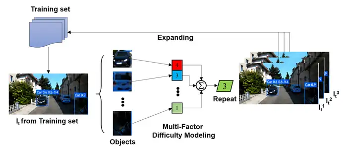
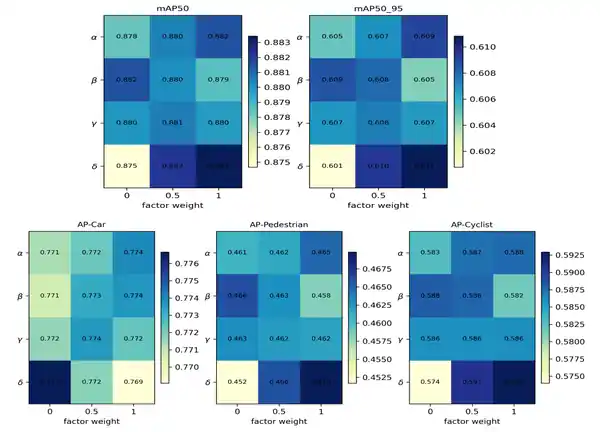

# Disentangling Difficulty Factors for Data-Driven Resampling in YOLO-Based Object Detection

> Accepted at PRCV 2026

This repository presents a data-centric training strategy for improving YOLO-based object detection on the KITTI benchmark. The method models image difficulty from four annotation-derived factors - object scale, occlusion, truncation, and class imbalance - and uses the resulting score to resample difficult training images.

The detector architecture remains unchanged, so the method introduces no additional inference-time modules or computational overhead.

<p align="center">
  
</p>

## Highlights

- Multi-factor image difficulty modeling from KITTI annotations.
- Adaptive image repetition with a maximum repeat factor of 5.
- A 3^4 = 81-setting grid search to disentangle factor contributions.
- High-resolution fine-tuning at 960 x 960 using the best resampling configuration.
- Improved difficult-category detection without modifying YOLO11n.

## Method

For an image \(I\), the image-level difficulty score is computed by accumulating object-level factors:

\[
\mathrm{Score}(I)=\sum_{b\in B(I)} \left(
\alpha\,\mathbf{1}_{\mathrm{small}}(b)+
\beta\,\mathbf{1}_{\mathrm{occluded}}(b)+
\gamma\,\mathbf{1}_{\mathrm{truncated}}(b)+
\delta\,\mathbf{1}_{\mathrm{hardCls}}(b)
\right).
\]

The score is linearly mapped to an image repetition number:

\[
R(I)=\min\left(R_{\max},\;1+\left\lfloor
\frac{\mathrm{Score}(I)}{\mathrm{Score}_{\max}}(R_{\max}-1)+0.5
\right\rfloor\right),
\]

where \(R_{\max}=5\).

The four factors are defined as follows:

| Factor | Symbol | Definition |
|---|---:|---|
| Small object | \(\alpha\) | Bounding-box area smaller than \(32^2\) pixels |
| Occlusion | \(\beta\) | KITTI occlusion level 2 or 3 |
| Truncation | \(\gamma\) | KITTI truncation ratio greater than 0.5 |
| Hard category | \(\delta\) | Pedestrian or Cyclist |

The best grid-search configuration is:

```text
alpha = 1.0
beta  = 0.0
gamma = 0.5
delta = 1.0
```

This setting emphasizes small objects and minority categories, moderately weights truncation, and avoids overemphasizing occlusion.

## Results

Validation results on KITTI are reported using mAP50, mAP50-95, and class-wise AP50-95.

| Method | mAP50 | mAP50-95 | AP-Car | AP-Pedestrian | AP-Cyclist |
|---|---:|---:|---:|---:|---:|
| YOLO11n Baseline | 0.866 | 0.595 | 0.767 | 0.443 | 0.575 |
| Random Oversampling | 0.878 | 0.613 | 0.784 | 0.459 | 0.596 |
| Class-Balanced Resampling | 0.875 | 0.598 | 0.760 | 0.475 | 0.558 |
| Fixed All-Factor Resampling | 0.886 | 0.612 | 0.774 | 0.466 | 0.596 |
| Best Grid-Search Resampling | 0.892 | 0.619 | 0.777 | 0.478 | 0.601 |
| Baseline + Fine-Tuning | 0.904 | 0.655 | 0.821 | 0.501 | 0.642 |
| **Best Resampling + Fine-Tuning** | **0.924** | **0.682** | **0.849** | **0.516** | **0.682** |

Compared with the original YOLO11n baseline, the final strategy improves:

- mAP50 by 5.8 percentage points.
- mAP50-95 by 8.7 percentage points.

Compared with baseline high-resolution fine-tuning, the proposed strategy improves mAP50-95 by 2.7 percentage points.

<p align="center">
  
</p>

The category-compensation factor contributes most consistently, especially for Pedestrian and Cyclist. Small-object and truncation factors are also beneficial when combined with category compensation, while the occlusion factor is less stable in this experiment.

## Experimental Setup

| Stage | Input size | Epochs | Batch size | Training data |
|---|---:|---:|---:|---|
| Baseline | 640 | 50 | 16 | Original set |
| Fixed resampling | 640 | 50 | 16 | Resampled set |
| Grid search | 640 | 50 | 16 | Different weighted resampled sets |
| Fine-tuning | 960 | 20 | 8 | Best resampled set |

Fine-tuning uses reduced augmentation strength:

```yaml
mosaic: 0.2
scale: 0.2
translate: 0.05
```

The KITTI data are split into training, test, and validation subsets with a 7:2:1 ratio. Only Car, Pedestrian, and Cyclist are retained.

## Repository Structure

```text
.
├── assets/                  # Method and factor-analysis figures
├── configs/                 # Paper-aligned experiment configurations
├── docs/                    # GitHub presentation and release notes
├── paper/                   # Publication-status notes
├── results/                 # Result tables from the accepted manuscript
├── src/                     # Exact experiment code should be placed here
├── .gitignore
└── README.md
```

## Code Release Status

This repository package currently contains the paper-aligned project presentation, configurations, result tables, and release checklist. The exact experiment scripts should be added from the original research workspace rather than reconstructed from the manuscript, so that the public repository remains faithful to the accepted work.

See [`docs/code_release_plan.md`](docs/code_release_plan.md) for the recommended organization of the original scripts.

## Dataset

KITTI is not redistributed in this repository. Download the dataset from the official KITTI website and follow its license and terms of use.

A recommended local layout is:

```text
data/kitti/
├── images/
├── labels_kitti/
├── labels_yolo/
└── splits/
    ├── train.txt
    ├── val.txt
    └── test.txt
```

Large datasets, model checkpoints, and experiment outputs are excluded through `.gitignore`.

## Citation

The official BibTeX entry and proceedings link should be added after the PRCV 2026 proceedings metadata and DOI are available.

```bibtex
@inproceedings{zhu2026difficulty_resampling,
  title     = {Disentangling Difficulty Factors for Data-Driven Resampling in YOLO-Based Object Detection},
  booktitle = {Proceedings of the Chinese Conference on Pattern Recognition and Computer Vision (PRCV)},
  year      = {2026},
  note      = {Accepted; author list and DOI to be updated}
}
```

## Acknowledgements

This work uses the KITTI object detection benchmark and the Ultralytics YOLO11 framework.
